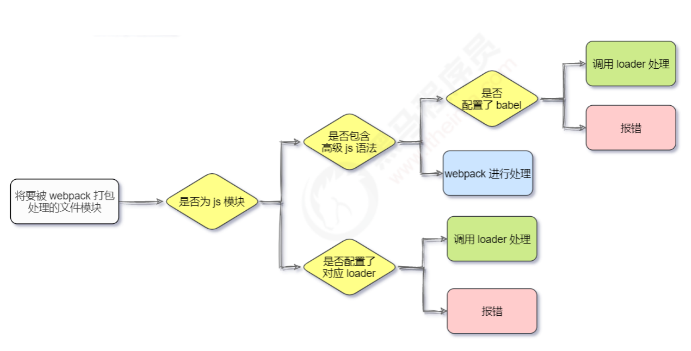
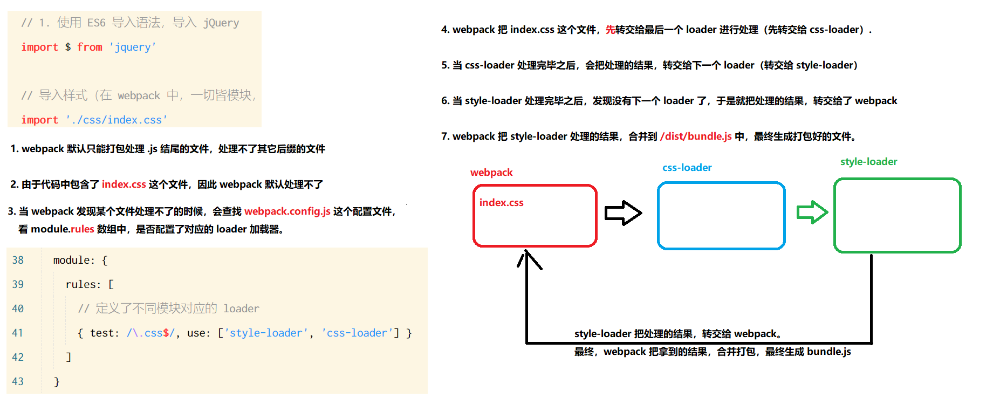
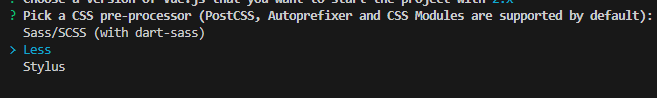
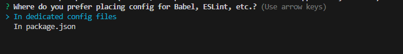

# 1.前端工程化：将工具，技术，流程与经验进行规范化与标准化
## 模块化（js的模块术，css的模块化，资源的模块化）
## 组件化（复用现有的UI结构，样式，行为）
## 规范化（目录结构的划分，编码规范化，接口规范化，文档规范化，Git分支管理）
## 自动化（自动化构建，自动部署，自动化测试）
# 2.webpack:
## 前端工程化的具体解决方案，提供了友好的前端模块化开发支持，以及代码压缩混淆、处理浏览器JavaScript的兼容性、性能优化等强大的功能
## 配置：
### 1.在项目根目录中，创建名为 webpack.config.js 的webpack配置文件，并初始化乳腺的基本配置
```JavaScript
module.exports = {
    mode: 'development'  // mode 用来指定构建模式，可选值有development 和 production
}
// 其中 development 是开发环境，不会对打包产生的文件进行代码压缩和性能优化，打包速度快，适合在开发阶段使用
// production 是生产环境，会对打包生成的文件进行代码压缩和性能优化，
```
### 2.在package.json的script节点下，新增dev脚本如下
```json
"script": {
    "dev": "webpack" //script 节点下的脚本，可以通过 npm run 执行，例如 npm run dev
}
```
### 3.在终端运行 npm run dev 命令，启动webpack进行项目打包的构建,在webpack 4.x 和 5.x 版本中，有如下默认约定：
- 默认的打包入口文件为 src -> index.js
- 默认的输出文件路径为 dist -> main.js 
- 可以在webpack.config.js中修改打包路径
### 4.webpack的插件
#### webpack-dev-server 类似于 node.js 的 nodemon 工具，每当修改了源代码，webpack会自动进行项目的打包和构建,使用如下代码安装（但是其生成的 bundle.js 会储存在内存中。而不是物理硬盘中，一方面方便频繁存储，但是也需要改变读取的路径，在根目录读取）
```shell
npm i webpack-dev-server@3.11.2 -D
```
- 修改package.json中的命令为
```json
  "scripts": {
    "dev": "webpack serve"
  }
```
- 再次运行 npm run dev 命令，重新进行打包
- 在浏览器中访问http://localhost:8080端口进行访问

#### html-webpack-plugin 是 webpack 中的 HTML插件（类似于一个模板引擎插件），可以通过此插件自定制 index.html 页面内容,将文件复制到根目录，进行直接访问，但是同样是存储到内存中
## webpack中的loader:实际开发中，webpack默认只能打包处理以 .js 后缀结尾的模块，其他以非 .js 结尾的模块，webpack默认处理不了，需要调用loader加载器才可以正常打包，否则会报错。
### loader加载器的作用是协助webpack打包处理特定的文件模块：
- css-loader 可以打包处理 .css 相关的文件
- less-loader 可以打包处理 .less 相关的文件
- babel-loader 可以打包处理 webpack 无法处理的高级JS语法


## webpack只能打包处理一部分高级的js语法，对于webpack无法处理的js高级语法，需要借助 babel-loader 进行打包处理，并且在 webpack.config.js 中的module.rules下配置好后，还需要在项目根目录下创建一个 babel.config.js 的配置文件
## Source Map 是一个信息文件，储存着位置信息，也就是混淆压缩后的代码所对应的转换前的位置，这样出错的时候，除错工具件直接显示原始代码，而不是转换后的代码，极大方便开发调试.项目发布时，处于安全考虑，关闭source map，也可以只定位行号，不暴露源码，将devtool的值设置为，nosources-source-map
# 3.vue
- vue是一套用于构建用户界面的前端框架
## 构建用户界面
- 用 vue 往 html 界面填充数据，非常方便
## 框架
- 框架是一套现成的解决方案
- 学习内容：vue的指令、组件（对UI的复用），路由，vuex
- vue特性：数据驱动视图、双向数据绑定
- 数据驱动视图：数据的变化会驱动视图自动更新，只需把数据维护好，页面结构会被自动渲染出来，这是一个单向的数据绑定
- 双向数据表绑定：双向绑定可以在不操作dom的情况下， 自动把页面数据同步到数据源，js数据VB的变化，会被vue自动获取，并更新到数据源中
> 在网页中，form表单负责采集数据，ajax负责提交数据
## MVVM 是vue实现数据驱动视图与双向数据绑定的核心原理，MVVM（Model、View 和ViewModel）
- Model 表示当前页面渲染时所依赖的数据源
- View 表示当前页面所渲染的DOM结构
- ViewModel 表示vue实例，它是MVVM的核心，它将页面数据源（Model）和页面结构（View）连接在一起
## 版本：
- 2.x 版本vue是目前企业级项目开发的主流版本
- 3.x 版本vue与2020-9-19发布，尚未推广
- 1.x 版本几乎被淘汰
## vue 的指令与过滤器
### 指令（Directives）是指vue为卡发着提供的模板语法，用于辅助开发者渲染页面的基本结构
- 内容渲染
- 属性绑定
- 事件绑定
- 双向绑定
- 条件渲染
- 列表渲染
#### 内容渲染指令：`v-text，{{}}，v-html`
- `v-text`指令的缺点是会覆盖元素内部原有的内容
- `{{}}`语法，插值表达式，专门用来解决v-text内容覆盖的问题,注意：插值只能用于内容节点，不能用于元素的属性节点
- `v-html`指令可以把带有标签的字符串，渲染成真正的html内容
#### 属性绑定指令 `v-bind`
- 插值表达式只能用在元素的内容结点中，不能用在元素的属性节点中
- 在vue中，可以使用 v-bind： 指令，为元素属性动态绑定值；简写是英文的冒号"："
  #### 使用 JavaScript 表达式
- 在vue提供的模板渲染语法中，也支持js表达式的运算
- 在使用 v-bind 属性绑定期间，如果绑定内容需要进行动态拼接，则字符串的外面应该包裹单引号，例如：
```HTML
  <div :title="'box' + index">这是一个div</div>
```
#### 事件绑定指令：v-on: 简写为@
#### 事件修饰符：跟在时间绑定指令之后，模拟原生事件方法：
- .prevent  组织默认行为(例如：阻止a链接的跳转、阻止表单的提交等)
- .stop  阻止冒泡事件
- .capture 以捕获模式触发当前的事件处理函数
- .once  绑定的事件只触发一次
- .self  只有在event.target是当前元素自身时触发事件处理函数
#### 按键修饰符 @keyup.esc @keyup.enter
#### 双向数据绑定指令 用来辅助开发者在不操作DOM的前提下，快速获取表单的数据,注意，只有表单元素使用 v-model 才有意义,如：
- input
- textarea
- select
##### 为方便对输入内容进行处理，v-model有专用修饰符：
- .number 自动将用户输入的值转为数值类型
- .trim 自动过滤用户输入的首位空白字符
- .lazy  在“change”时而非“input”时更新
#### 条件渲染：v-if v-show
- v-show 的原理是动态为元素添加或移除 `display：none` 样式，来实现元素的显示或隐藏，如果要频繁的切换元素的显示状态，用 v-show 性能会更好
- v-if 的原理是每次动态添加或移除元素，实现元素的显示和隐藏，如果加载页面时不需要展示元素（默认不展示），而且后期这个元素也很可能不需要被展示出来，用 v-if 会减少资源的消耗
- 在实际开发中，不用考虑性能问题，直接使用 v-if 就好
#### v-else-if指令
- v-else-if 必须配合 v-if 使用，否则不会被识别
#### v-for 列表渲染指令，用于需要循环生成的页面元素
#### 过滤器函数，仅在vue2适用，vue3已去除
- 要定义到 filters 节点下，本质是一个函数
- 在过滤器函数中，一定要有 ruturn 值
- 在过滤器的形参中，就可以获取到“管道符”之前待处理的那个值
- 如果全局过滤器和私有过滤器名字冲突，按照就近原则，调用的是私有过滤器
## watch侦听器，允许开发者监视某些数据的变化，从而针对数据的变化做出某些特定的操作
##### 侦听器的格式：
- 方法格式的侦听器，
  > 缺点一：无法在跟进入页面的时候马上触发一次
  > 缺点二：如果侦听的是一个对象吗，对象属性的变化不会触发侦听器
- 对象格式的侦听器
  > 好处一：通过**immedate**选项，让侦听器自动触发
  > 好处二：可以通过**deep**选项，让侦听器深度监听每个选项的变化
## 计算属性：计算属性是指通过一系列运算之后，最终得到一个属性值，这个动态计算出来的属性值可以被模板结 v-bind 构或methods方法使用
- 定义的时候，要被定义成方法
- 在使用的时候，当做普通的属性使用
- 实现了代码的复用
- 只要属性中依赖的数据源变化，则计算属性会自动重新求值
## axios是一个专注于网络请求的库
- 
- 基本使用：
- 发起 GET 请求
```JavaScript
  axios({
      method: 'GET',
      // 请求的地址
      url: 'http://www.liulongbin.top:3006/api/getbooks' ,
      // URL 中的查询参数
      params: {},
      // 请求体参数
      data: {}
  }).then((books)=>{
      console.log(books);
  })
```
- 发起 POST 请求
```JavaScript
const {data} = await axios({
    method: "POST",
    url: 'http://www.liulongbin.top:3006/api/getbooks',
    data: {
        name: 'zs',
        age: 20,
    }
})
```
## vue-cli:
### 单页面应用：（single page application），一个web网站中只有唯一的一个HTML页面，所有的功能在一个页面上完成
### vue-cli是vue.js开发的标准工具，它简化了程序员基于webpack创建工程化的vue项目的过程，步骤如下：
- 在需要创建的目录的终端下运行`vue create *项目名称`
- 选择自己创建项目
- 选择此配置
- 选择css预处理器
- 选择babel与eslint的配置储存在何处(使用单独的配置文件，而不是储存到package.json中)
### vue 项目中 src 项目的构成
- 1.assets 文件夹，存放项目中用到的静态资源文件，例如：css样式表，图片资源
- 2.components 文件夹，程序员封装的、可复用的组件，都要放到 components 目录下
- 3.main.js是项目的入口文件，整个项目的执行，都要先执行main.js
- 4.App.vue 是项目的根组件
### vue 项目的运行流程：通过main.js吧App.vue渲染到index.html的指定该区域中
### vue组件化开发，vue是一个支持组件化开发的前端框架，组件分为三部分：
- templata 组件的模板
- script 组件的JavaScript行为
- style 组件的样式
- 组件被封装好后，彼此之前是相互独立的，不存在父子关系
#### 组件使用的三个步骤：
- 使用import语法导入需要的组件
- 使用components节点注册组件
- 以标签形式使用刚才的组件